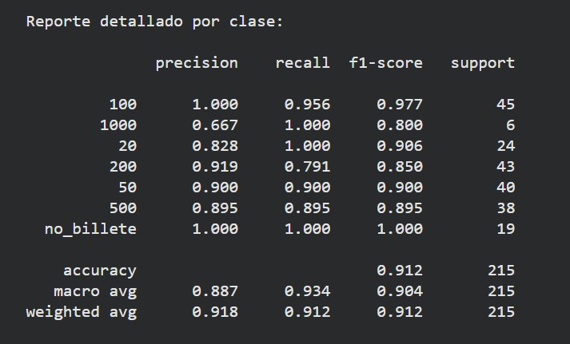
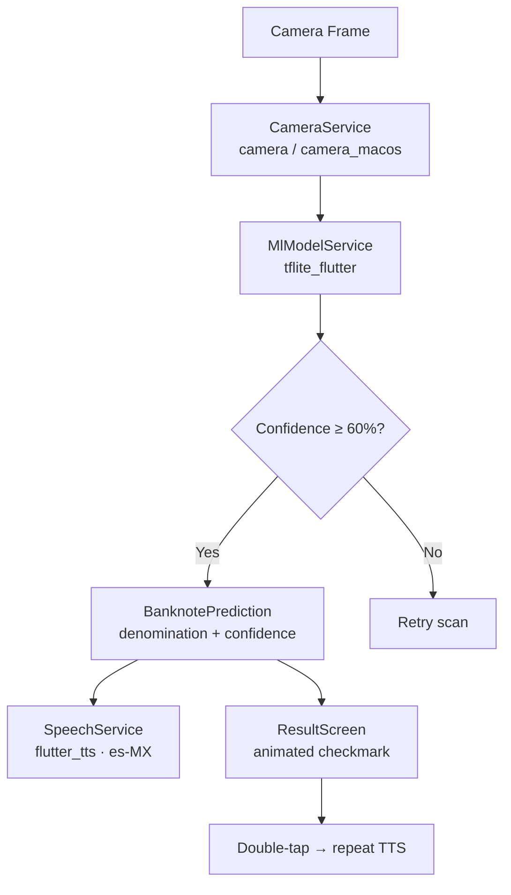
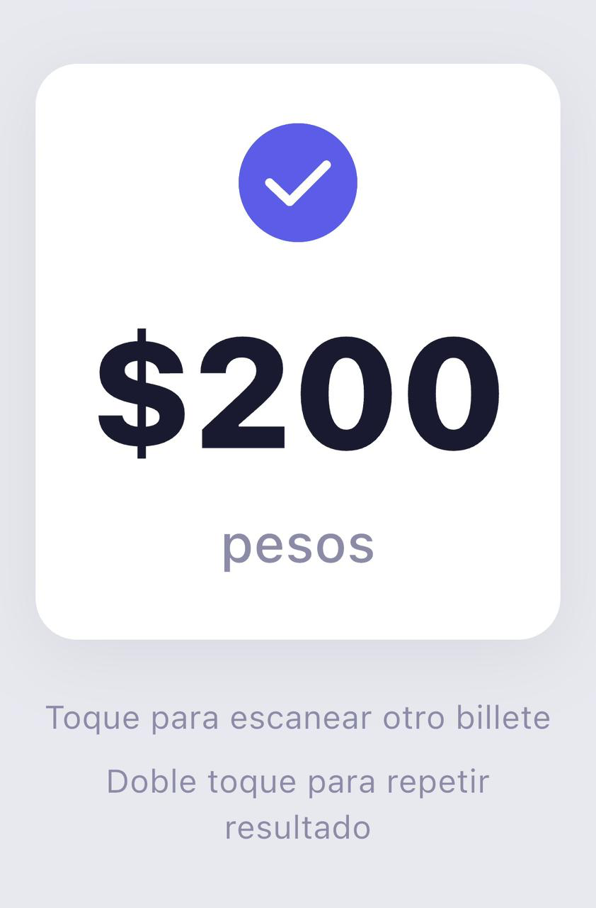

# Habla Billete

Offline AI-powered accessibility app that identifies Mexican banknotes in real time and announces the denomination aloud — designed for blind and low-vision users. No internet required. All inference runs on-device using a MobileNetV3 model exported to TFLite.

## How it works

1. The user opens the app and points the camera at a banknote
2. The **camera service** captures a frame and passes it to the **ML pipeline**
3. The **TFLite interpreter** resizes the image to 224×224, runs it through MobileNetV3-Small, and returns a softmax probability over 7 classes
4. If confidence exceeds 60%, the **denomination is announced in Spanish** via text-to-speech
5. The result screen shows the amount with an animated checkmark; a double-tap repeats the announcement

## Stack

| | |
|---|---|
| Model | MobileNetV3-Small — trained on custom Mexican banknote dataset, exported as TFLite FP32 |
| Training | TensorFlow / Keras · Python |
| Inference | tflite_flutter 0.11.0 · on-device, fully offline |
| App | Flutter (Dart) — iOS + macOS |
| Camera | camera (iOS) · camera_macos (macOS) |
| Speech | flutter_tts · Spanish es-MX, 0.45x rate |
| Image processing | image 4.0 — decode + bilinear resize to 224×224 |

## Model results

Evaluated on a held-out test set of 215 images across 7 classes.



| Denomination | Precision | Recall | F1 |
|---|---|---|---|
| $20 | 0.828 | 1.000 | 0.906 |
| $50 | 0.900 | 0.900 | 0.900 |
| $100 | 1.000 | 0.956 | 0.977 |
| $200 | 0.919 | 0.791 | 0.850 |
| $500 | 0.895 | 0.895 | 0.895 |
| $1000 | 0.667 | 1.000 | 0.800 |
| no_billete | 1.000 | 1.000 | 1.000 |
| **Overall accuracy** | | | **91.2%** |

The $1000 bill has the lowest precision due to limited training samples (6 in the test set). All other denominations exceed F1 0.85.

## Architecture



## Screenshots

### Result screen — $200 detected


### Camera scanning


### Home screen


## Repository layout

```
mexican-banknote-recognition/
├── mobile_app/          # Flutter app
│   ├── lib/
│   │   ├── models/      # BanknotePrediction
│   │   ├── providers/   # BanknoteProvider (state)
│   │   ├── screens/     # Home, Camera, Result
│   │   └── services/    # Camera, ML, Speech
│   └── assets/
│       ├── modelo_billetes_fp32.tflite
│       └── class_names.txt
├── ai_model/
│   └── entrenamiento_billetes.py   # Training script (Colab)
├── dataset/             # Raw + augmented banknote images
└── docs/
    └── images/
```

## Run on iOS

```bash
cd mobile_app
flutter pub get
cd ios && pod install && cd ..
flutter run -d <iphone-device-id>
```

## Run on macOS

```bash
cd mobile_app
flutter build macos
open macos/Runner.xcworkspace   # then Cmd+R in Xcode
```

## Accessibility design

- **No tap required** — scanning starts automatically on launch
- **Auto-retry** — if no banknote is detected, the app retries silently
- **VoiceOver compatible** — all interactive elements have semantic labels
- **Sonar ring animation** — provides visual feedback while scanning (non-essential for the core UX)
- **Double-tap to repeat** — last announcement can be replayed from the result screen
